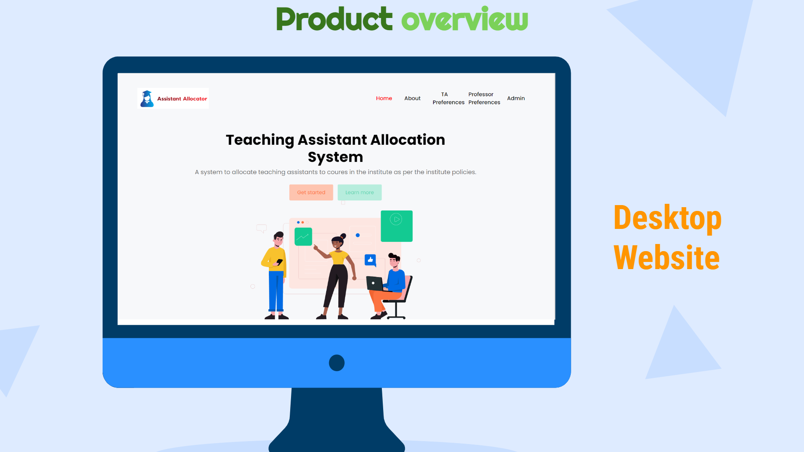
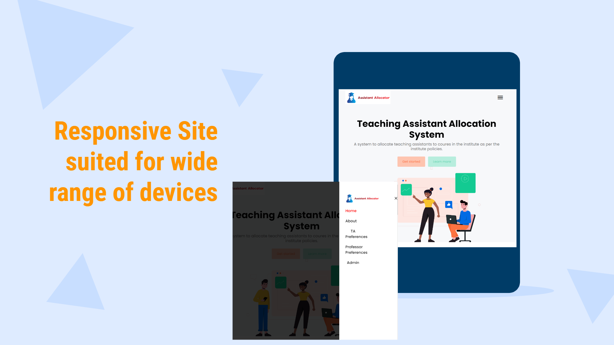
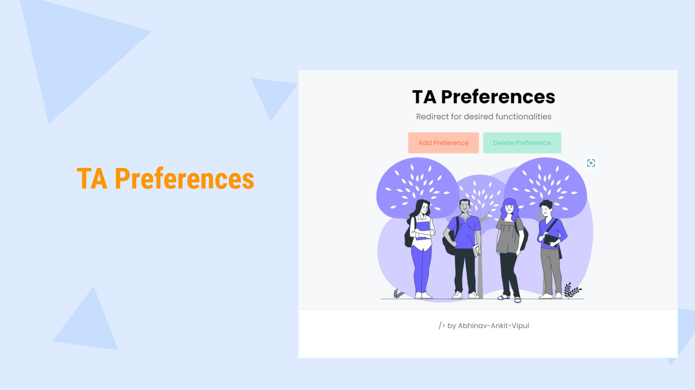
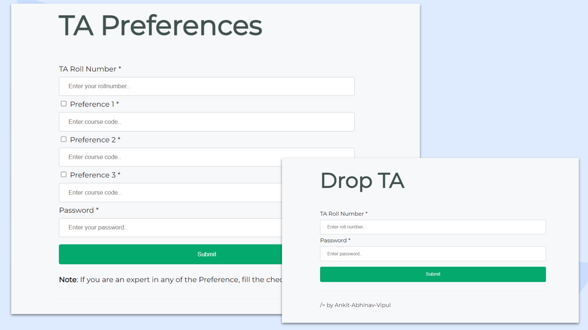
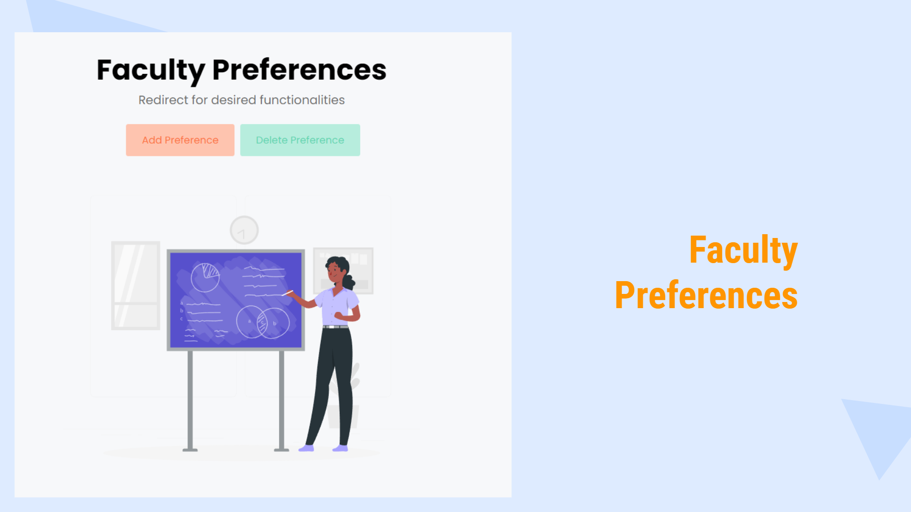
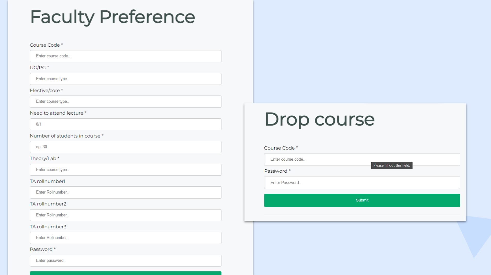
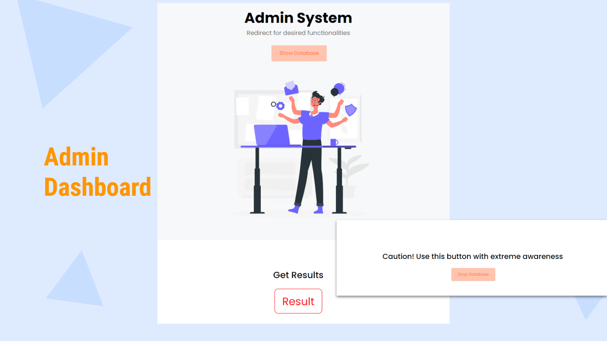
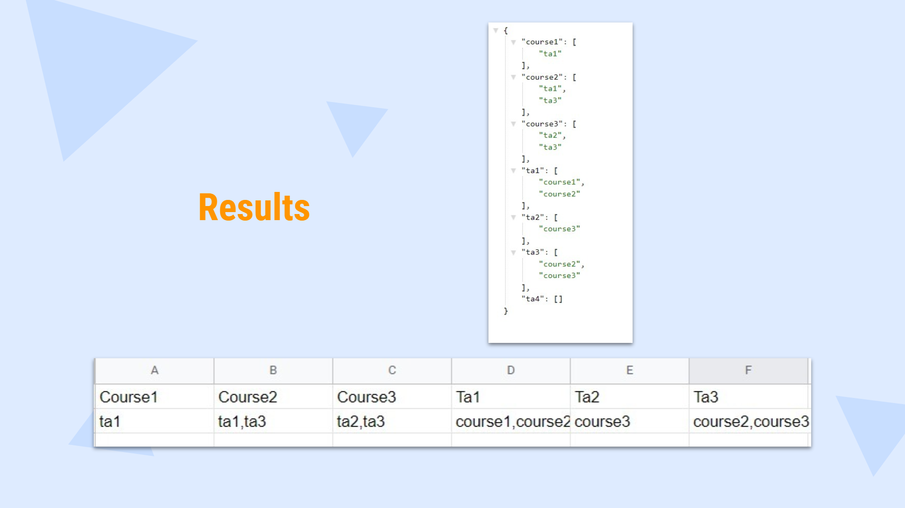

# TA-Allocation-System

With the automation of tasks and increasing 

### DESIGN AND PROBLEM FORMULATION
Till now, no platform is present and open for catering and automating the Teaching assistant allocation on campus.
We hope to solve this problem catering to the high number of students, faculties and courses which are institute is and will be offering in future, being in a developing stage.

### POSSIBLE METHODS TO SOLVE THE PROBLEM
Creating section/forms for the students and faculties to fill their preferences of the courses they want to be a teaching assistant and courses to be open for TAship respectively.\
Creating an ADMIN based functionality to trigger an algorithm based on stable matchin to produce the results.

#### SOLUTION
STEP 1 : Student fills the course preferences
STEP 2 : Faculty adds their course, and fills their preferences
STEP 3 : The data gets stored simultaneously in MongoDB hosted in AWS
STEP 4 : Admin triggers the result algorithm and transfers the JSON based produced results to the google sheet.

### FRONT-END

### BACK-END 
#### ALGORITHM
We used an extension of stable matching algorithm.
In stable matching, we need to match every man to only one woman and vice-versa. But in our case, the TA can be matched to upto many courses and a course can be given to a number of students.
Upper Cap on TA allotted to a course depends on the number of students in the course and course type (i.e Theory/Lab).

Firstly, we store the input data into the MongooDB Database. Then, we make two preference lists, one for TA and other for Courses. 
Now, it is possible that some of the courses instructor did not give any TA preference or maybe a prefix of RollNumber (like B19CSE), then we will check which of TA’s have that prefix and insert the RollNumber in the list and if none does, then insert TA’s randomly.
Important thing is that this will handle all the corner cases that can possibly happen. (Like if a course has a Ta in its preference which does exist, then it will be taken care of).

Now that we have preference lists of both courses and TAs, we can finally implement our Extended Stable Matching:
We iterate on Courses and assign them their most preferred TA.
Now, if we come across a TA which more than 3 faculty want as their most preferred TA, then we will check the TA preference for courses and will be assigned to the top 3 course.
We keep doing this until all courses has reached their Upper Cap or all the TA’s has been assigned to 3 courses.
If their is still a clash, we have the following rules:
Core courses are to be preferred from elective courses.
UG courses are to be preferred over PG courses.
Higher year UG/PG courses are to be preferred from lower year UG/PG courses

### Process Pipeline
#### Planning
● Identifying target audience- Institute Level in Various Dept.\
● Defining basic deliverables and user requirements\
● Exploring Technologies\
● Choice of panels\
● Platform\
● Web/standalone application\
● Budget and Team\

#### Pre-Production
● Finalizing technology\
● Embedding Panels in application\
● Rough Layout of project code - Diagrams , Front end, Algorithm\

#### Production
● Website\
● Front End : HTML CSS Javascript jQuery, Bootstrap\
● BackEnd : NodeJs , ExpressJs\
● Database: MongoDB\
● Deployment Servers : Heroku, AWS - MongoDB\
● Git & Github for Version Control

#### Launch, Testing, Feedback and Update
●  To be done 

